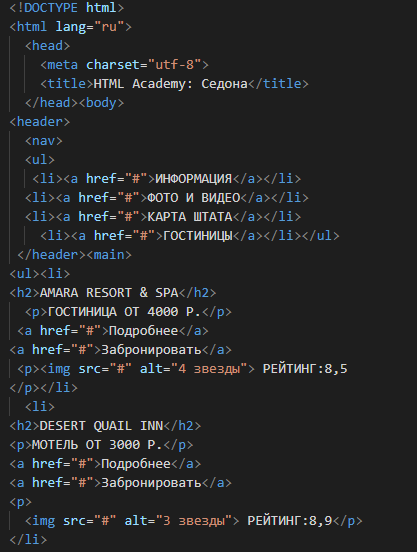

# Форматирование HTML кода. Зачем и как
Писать код можно вообще не заморачиваясь. В одном месте есть пара пробелов, в другом нет, в третьем есть переносы строк,
в четвертом нет, какая разница? Браузер все равно всё "скушает" и покажет страничку, главное писать без ошибок.



Дейстаительно, браузеру нет никакой разницы. Прежде чем отобразить страничку, он вырезает из неё все лишние пробелы и 
переносы строк, и только потом начинает её синтаксический разбор, чтобы показать на экране. Разница есть только для 
нас - разработчиков и верстальщиков. 

**Форматирование кода** - это оформление его особоым образом, чтобы код выглядел единообразно, его было удобно читать и 
удобно вносить изменения.

Знаете, какая реакция будет у оптытного разработчика, который посмотрит код на картинке выше? Примерно такая: 
> О Боже мой... Кто это писал? Нужно всё переделать

Правил по написанию хорошоего кода можно найти очень много, они известы как "кодгайды". Они все описывают сколько 
пробелов надо использовать для отсупов, большие буквы или маленькие, двойные кавычки или одинарные... Но ни один
кодгайд не описывает основы форматирования. 

В этой статье я постарался описать 4 правила, которые не всегда очевидны для
тех, кто только начинает свой путь, и показать, насколько они важны.


## 1. Одна строка - один тег
Небольшой эксперемент. В каком из вариантов вам будет проще найти тег ``?

```html
<h2>Lorem ipsum dolor sit amet.</h2><div>like: 20</div><div>view: 100</div><div>share: 50</div><h2>Lorem ipsum dolor sit amet, consectetur.</h2><div>like: 20</div><div>view: 100</div><div>share: 50</div>
```

```html
<h2>Lorem ipsum dolor sit amet.</h2>
<div>like: 20</div>
<div>view: 100</div>
<div>share: 50</div>

<h2>Lorem ipsum dolor sit amet, consectetur.</h2>
<div>like: 20</div>
<div>view: 100</div>
<div>share: 50</div>
```

Скользить глазами в поисках сверху вниз, где каждый тег начинается с новой строчки - намного проще и быстрее, чем 
выискивать его среди кучи других тегов, никак не отделенных друг от друга, не так ли? Поэтому возьмите себе за правило:
**одна строка - один тег**.


## 2. Слишком длинуую строку лучше разбить на несколько

Вы наверняка сталкивались с чтением текста, строчки у которого были слишком длинными и их приходилось прокручивать 
слева-направо, а потом возвращаться обратно. Это как минимум неудобно, а если текста очень много, то еще и легко 
потерять ту строку, которую только что читал. 

В коде - все тоже самое. Читать длинные строки крайне неудобно. Это должно было быть понятно еще из первого правила, где
я предалагал поискать вам тег ``. **Старайтесь, чтобы в строке кода было не более 120 символов**. Многие редактороы
кода помогают в этом разработчикам, и рисуют линию, за которою желательно не выходить, а если в вашем редакторе такой
линии нет - поищите для него плагин.
[todo: скрин редактора кода с линией обрыва]

## 3. Показывай вложенность тегов друг в друга
Это, пожалуй, самое крупное правило, и самое важное. По большей части именно от него зависит, насколько легко будет
читаться и редактироваться ваш код.

Давайте взглянем на следующий пример:

```html
<div class="item-wrap">
<div class="item-img-wrap">

</div>
<div class="item-info">
<div class="item-info-about">Это какой-то совершенно никому не нужный товар, который стоит овер-много</div>
<div class="item-info-buttons">
<button>В корзину</button> 
<button>В закладки</button> 
<button>Купить сейчас</button> 
</div>
</div>
</div>
```

Очень много дивов. Очень. Сможете сходу определить в каком диве что лежит? А какой закрывающий `</div>` от какого 
открывающего? Сложновато. 

Чтобы в этом было проще разобраться - нужно показывать, как теги вкладываются друг в друга. 

### Показываем вложенность
Начнем с простого примера:
```html
<section>
|  <h1>Это заголовок</h1>
|  <p>Это параграф c каким то текстом</p>
|  <button>Какая-то кнопка</button>
</section>
```

Для наглядности, я нарисовал линию, идущую от откывающего тега `<section>` к закрывающему. Всё, что находится правее 
этой линии - это содержимое этого тега. Оно сдвинуто вправо на некоторое количество пробелов. Глядя на этот код можно
точно определить:
- Где открывается тег `<section>` и где он закрывается
- Какие теги вложенны в тег `<section>`

Возьмем пример еще чуть сложнее:
```html
<section>
|  <h1>Это заголовок</h1>
|  <p>Это параграф c каким то текстом</p>
|
|  <div class="buttons">
|  |  <button>Кнопка 1</button>
|  |  <button>Кнопка 2</button>
|  </div>
</section>
```

Здесь добавлен `<div>` внутрь которого вложены две кнопки. Он отформатирован по таким же правилам: кнопки `<button>` 
сдвинуты на несколько пробелов правее линии div-a, тем самым показывая, что они вложены внутрь него, а сам `<div>` 
вложен внутрь `<section>`.

### Не нарушайте уровни вложенности. Если один из тегов вылазит не на свой уровень - это вносит путаницу.
Например здесь, `div` вылез на уровень выше, из-за чего теперь кажется, что он не должен быть 
вложен внутрь `section`, а для `section` мы пропустили закрывающий тег, хотя на самом деле всё не так:
```html
<section>
|  <h1>Это заголовок</h1>
|  <p>Это параграф c каким то текстом</p>
|
<div class="buttons">
|  <button>Кнопка 1</button>
|  <button>Кнопка 2</button>
</div>
</section>
```

Теперь, зная как нужно показывать вложенность одних тегов в другие, попробуем отформатировать первый пример:

```html
<div class="item-wrap">
|  <div class="item-img-wrap">
|  |  
|  </div>
|  <div class="item-info">
|  |  <div class="item-info-about">
|  |  |  Это какой-то совершенно никому не нужный товар, который стоит овер-много
|  |  </div>
|  |  <div class="item-info-buttons">
|  |  |  <button>В корзину</button> 
|  |  |  <button>В закладки</button> 
|  |  |  <button>Купить сейчас</button> 
|  |  </div>
|  </div>
</div>
```

Стразу стало понятней, не так ли?

### Направляющие линии в редакторах кода
Современные редакторы кода обычно сами рисуют линии, которые я рисовал при помощи символа `|`, чтобы помогать видеть 
уровни вложенности. Если ваш редактор таких линий не рисует, то поищите для него плагин, он может называться, например
**indent guides**.

### Еще немного слов об отсупах
Как уже говорилось выше, для того, чтобы показать вложенность используются пробелы, это, скажем так, стандарт. Сколько
их использовать - 2, 3, 4, 8 - дело ваше, главное, чтобы на один сдвиг было всегда одинаковое количество пробелов.

Редакторы кода обычно уже настроены на два либо четыре пробела. Чтобы быстро сдвинуть уровень вложенности вглубь, 
выделите нужные строки с тегами и нажмите клавишу `Tab` необходимое количество раз. За одно нажатие клавиши ваши теги
автоматически сдвинутся на 2 или 4 пробела, в зависимости от настроек редактора.

Чтобы уменьшить уровень вложенности - выделите нужные строки и нажмите сочетание клавиш `Shift + Tab` необходимое 
количесвто раз.

## 4. Отделяйте разные по смыслу части пустыми строками
Допустим, мы пишем код для главной страницы сайта. Что-то вроде этого:
```html
<section>
  <h2>Тут у нас новости</h2>
  <article>...</article>
  <article>...</article>
  <article>...</article>
</section>
<section>
  <h2>Тут у нас основные разделы сайта</h2>
  <div>...</div>
  <div>...</div>
  <div>...</div>
</section>
<section>
  <h2>Тут у нас какие-то виджеты</h2>
  <div>...</div>
  <div>...</div>
  <div>...</div>
</section>
```

Здесь все в сильно сокращенном виде, на реальном сайте этот код будет занимать куда большее количество строк. И было бы
неплохо отделять одни разделы от других, которые отличаются по смыслу, чтобы было проще среди них ориентироваться.
Отделять их принято одной или несколькими пустыми строками:

```html
<section>
  <h2>Тут у нас новости</h2>
  <article>...</article>
  <article>...</article>
  <article>...</article>
</section>

<section>
  <h2>Тут у нас основные разделы сайта</h2>
  <div>...</div>
  <div>...</div>
  <div>...</div>
</section>

<section>
  <h2>Тут у нас какие-то виджеты</h2>
  <div>...</div>
  <div>...</div>
  <div>...</div>
</section>
```

## Выводы
Всего 4 этих правила уже могут помочь сделать ваш код читаемым и пригодным для внесения изменений как сейчас, так и в 
будущем. Да и показать другим его уже будет не так стыдно. 

Надеюсь, что я всё объяснил максимально подробно и понятно. Успехов!